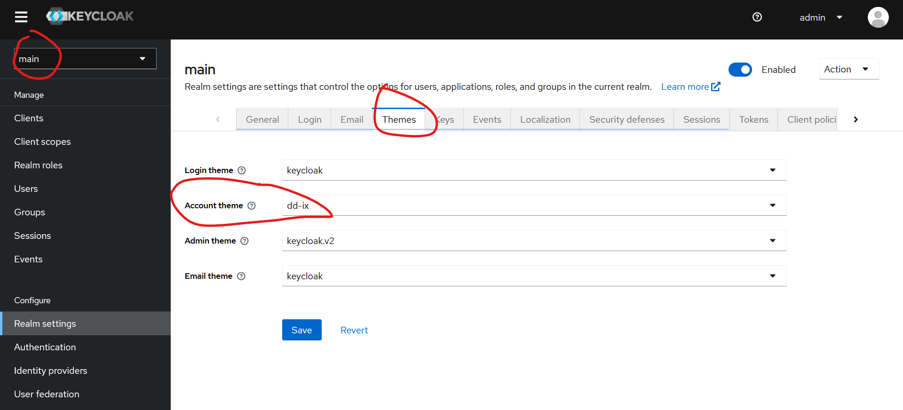

# DD-IX Keycloak Themme

## Installation

1. Create potentially missing folders
   ```
   mkdir -p /opt/keycloak/themes
   ```

2. Clone the reposetory
   ```
   git clone https://github.com/dd-ix/keycloak-theme.git /opt/keycloak/themes/dd-ix
   ```

3. Activate the Theme in the Keycloak webinterface.
   
